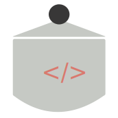

# Scaffolder



Scaffolder is a command-line interface tool written in Golang designed to automate the mundane task of manually creating barebones for your project. It takes the neccesary directory structure defined in a _reusable_ config YAML file, which is very easy to work with for both humans and parsers.

See templates for some programming languages here: [Scaffold configs](https://github.com/cemister/scaffold-configs)

Quick example:

```yaml
hello1: # Folder name
  hello.txt: | # File name
    Hello World # File content
  hello1.txt: # File name (empty)
  hello2.txt: # File name (empty)
hello2: # Folder name
  hello22.txt: # File name (empty)
```

```bash
$ scaffold --name hello --yaml test
```

It's pretty much straightforward; hello1 is the folder, and hello.txt, hello1.txt, hello2.txt are the files inside it.
The result is:

```
example
├── hello1
│   ├── hello.txt
│   ├── hello1.txt
│   └── hello2.txt
└── hello2
    └── hello22.txt
```
hello.txt:
```
Hello World
```

Tip: | in YAML is for multiline text

## TODO

- [x] Change default config folder to a dotfile - `~/.scaffolder`
- [x] `--configdir` flag to let the user specify path to custom config folder. Fallback to default path if empty, also let user get the config from current working directory
- [x] Remember custom config directory if specified AND `--remember` is true (by default false)
- [x] Additional error handling for new features
- [x] YAML variables that can be set using a flag. $MY_VAR: Test, a: {MY_VAR}. Parse and replace {MY_VAR} with the actual value.

## Install

If you are not planning to contribue OR you don't need the very last releases:

### Linux / MacOS

1. Change your directory to home:

```bash
$ cd ~
```

2. Create a folder for scaffolder and navigate there:

```bash
$ mkdir scaffolder
$ cd scaffolder
```

3. Download the latest release (repeat this step to update it in future, replace stable-v1_1_5 with tag of latest version if i forgot to change readme):

```bash
# Linux:
$ wget -q -O scaffold https://github.com/cemister/scaffolder/releases/download/stable-v1_1_5/scaffolder_linux
# MacOS:
$ curl -s -o scaffold https://github.com/cemister/scaffolder/releases/download/stable-v1_1_5/scaffolder_macos
```

4. Turn the file into an executable:

```bash
$ chmod +x scaffold
```

5. Add the executable to PATH:

```bash
$ echo 'export PATH="$HOME/scaffolder:$PATH"' >> ~/.bashrc
```

6. Update bash config (Might restart the terminal as well):

```bash
$ source ~/.bashrc
```

### Windows

1. Open Command Prompt (cmd) or PowerShell and change the directory to the user's home directory:

```bash
# cmd:
cd %userprofile%

# PowerShell:
cd $env:userprofle
```

2. Create a folder named "scaffolder" and change the current directory to it:

```bash
mkdir scaffolder
cd scaffolder
```

3. Download latest scaffolder windows release (repeat this step to update it, replace stable-v1 with tag of latest version if i forgot to update the readme):

```bash
curl -s -o scaffold.exe https://github.com/cemister/scaffolder/releases/download/stable-v1_1_5/scaffolder_win.exe
```

4. Add the executable to the PATH in Windows:

- Press `Win + S` to open the Windows search bar.
- Search for "Environment Variables" and select "Edit the system environment variables."
- In the System Properties window, click the "Environment Variables" button.
- In the Environment Variables window, find the "Path" variable under "User variables" and click "Edit."
- Click "New," then enter the full path to the "scaffolder" folder (e.g., `C:\Users\YourUsername\scaffolder`) and click "OK" to add it to the PATH.

Note: Make sure to replace `YourUsername` with your actual Windows username.

Note that `curl` in Windows can be used if you have it installed (comes pre-installed starting from Windows 10 1803), or you can use a graphical web browser to download the executable.

## Build

To build from source, make sure you have installed Golang:

1. Clone the repository (Make sure you have installed Git. Pre-installed on macOS since Mavericks (10.9) and on majority of Linux distributions)

```bash
$ git clone https://github.com/cemister/scaffolde.git
```

2. Navigate to the project directory

```bash
$ cd scaffolder
```

3. Build the project

```bash
$ go build
```

## Usage

```
# Use without angle brackets.
# Also wrap the path in quotes.
# Arguments with ? are optional.
$ scaffold --name <project name> --yaml <config name> --configdir? <path to custom folder if exists> --git? <true/false> --remember? <true/false>
```
scaffolder 1.1.7:

- `--variables` - new flag introduced to allow you set yaml varibales which can be used when scaffolding your project

Example:
```bash
$ scaffold --name example --yaml "hello" --variables language:go,type:compiled
```
```yaml
hello:
  main.go: |
  package main
  import fmt

  name := "{language}"
  type := "{type}"

  func main(){
   fmt.Println("%s is %s", name,type)
  }
```
Result
```
example
├── hello1
│   ├── hello.go
```
with hello.go having the content
```
  package main

  import "fmt""

  func main(){
    name := "go"
    type := "compiled"
    fmt.Fprintf("%s is %s", name, type)
  }
```

Scaffolder 1.1.6:

- `--remember` - new flag introduced to save the custom path to config folder with yaml files, specified in --configDir flag, avoiding the need to specify the path each time. To reset, set --configDir to "". The custom path is saved to a text file, which is located in same directory as scaffolder executable, meaning you can edit the path without running the tool itself.

The config folder must be located inside your home directory:

Scaffolder 1.1.5:

- Name of config folder: scaffolder-configs -> .scaffolder. It is a dotfile, meaning it's hidden by default, so you should either manipulate it using a terminal or toggle visiblity of hidden folders. Please rename the folder for compatiblity with this version

as of 1.16.1, the .scaffolder dotfile should be in user's app config folder (usually `~/.config`)

- `--configdir` - new flag using which you can specify path to your custom config folder. Example below, it looks for the yaml config inside path specified in configdir which is .custom_configs folder in home directory (Unix)

```bash
scaffold --name test --yaml cpp --configdir "~/.custom_configs"
```

- If you want to get yaml in current directory, make sure it doesn't exist in .scaffolder and configdir is empty. The usage is same as normal.

Example:

```bash
$ scaffold --name example --yaml "hello"
```

It will create the project folder and scaffold it, based on the provided YAML file. You can also make it automatically initialize a Git repository inside the project by setting `git` to true.

In addition to example above, here's a few more:

To create a file inside the parent (project's) directory, we create a "." collection:

```yaml
.:
  main.txt:
```

To create a subdirectory (folder inside a folder), we create a new collection with it's name being the name of parent folder and then the name of needed folder, separated by a slash (/):

```yaml
hello1:
  hello.txt:
  hello1.txt:
  hello2.txt:
hello2:
  hello22.txt:
hello2/hello3:
  hello33.txt:
```

Result:

```
example
├── hello1
│   ├── hello.txt
│   ├── hello1.txt
│   └── hello2.txt
└── hello2
    ├── hello22.txt
    └── hello3
        └── hello33.txt
```

To create a folder inside hello3, we do the same:

```yaml
hello2/hello3:
  hello33.txt:
hello2/hello3/hello4:
  hello44.txt:
```

Result:

```
example
└── hello2
    └── hello3
        ├── hello33.txt
        └── hello4
            └── hello44.txt
```

To create an empty folder, we create an empty collection without values:

```yaml
helloempty:
```

Result:

```
example
└── helloempty
```

Here's a more advanced example (note it's pseudocode only to showcase scaffolder):

```yaml
.:
  webpack.json: |
    // Some stuff here

modules/typescript:
  a.config.ts: |
    import { A } from "a";
    if (A) {
      console.log(1);
    }

modules/colort:
  colort.config.ts: |
    import { A } from "a";
    if (A) {
      console.log(1);
    }
src:
  index.ts: |
    let a = false;
    console.log(a);
    console.log("Hello!");
```

Result:

```
example
├── webpack.json
├── modules
│   ├── typescript
│   │   └── a.config.ts
│   └── colort
│       └── colort.config.ts
└── src
    └── index.ts
```

Every file has it's corresponding contents.

## Contributing

If you want to contibute to Scaffolder but don't know how, refer to the official Github guide - [Contributing to projects](https://docs.github.com/en/get-started/quickstart/contributing-to-projects)

## License

This project is licensed under the Apache License, Version 2.0. See the [LICENSE](LICENSE) file for details.
